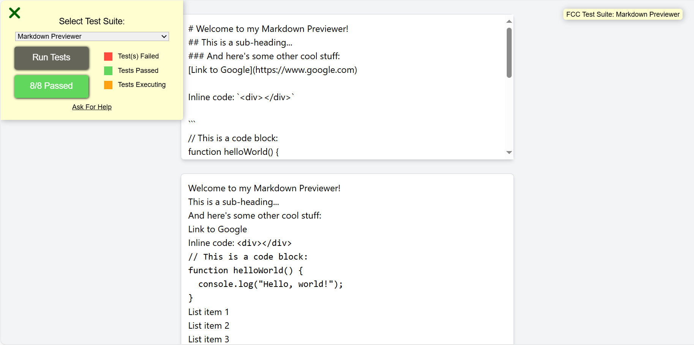
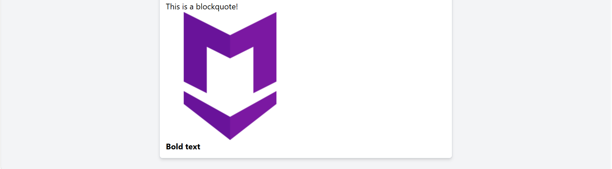

# Markdown Previewer React 🚀

## A React-based Markdown Previewer application that dynamically converts and displays GitHub-flavored Markdown into HTML. This project allows users to enter Markdown syntax into a text area and see a live preview of the rendered HTML as they type.📝


## Demo 📸

[Live Demo](https://beautiful-strudel-e850c7.netlify.appThank)





## Technologies Used 🛠️

- HTML
-twilind CSS
- JavaScript
- React
- Node.js


## Installation 💻

```bash
1: Clone the Repository:
git clone https://github.com/Breshnahamidi20/markdown-previewer1.git
```

```bash
2: Navigate to the Project Directory:
cd markdown.previewer
```

```bash
3: Open the index.html , App.js  and another Files in Your Browser.
```

## Usage 🎯

```bash
# Clone the repo to your local machine.
# Install dependencies using npm install or yarn install.
# Run the project with npm start or yarn start.
# Write markdown and see the live preview instantly.
# Customize the preview using CSS and build for production if needed.
```

## Features ⭐

- User-Friendly Interface: The application features a clean and intuitive design, making it easy to write and preview markdown without distractions.
- Responsive Design: The interface adapts seamlessly to different screen sizes, ensuring a smooth experience on both desktop and mobile devices.
- Syntax Highlighting: Supports syntax highlighting for code blocks, enhancing readability and making it easier for developers to showcase their code.

## Author 👩‍💻

- [Linkedin](https://www.linkedin.com/in/breshna-hamidi-67699a295?utm_source=share&utm_campaign=share_via&utm_content=profile&utm_medium=android_app)
- [Email](breshna2004@gmail.com)


## Contributing 🤝
To contribute, submit bug reports, feature requests, or pull requests via the GitHub repository issues and pull requests tabs.